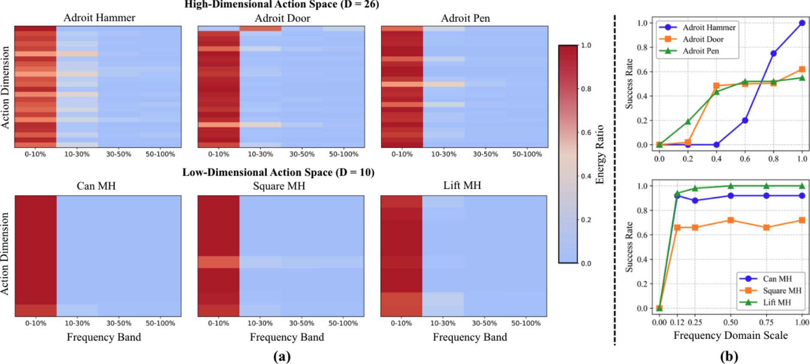

<br>
<p align="center">
<h1 align="center"><strong> FreqPolicy: Frequency Autoregressive Visuomotor Policy with Continuous Tokens
</strong></h1>
  <p align="center">
      <strong><span style="color: red;">NeurIPS 2025</span></strong>
    <br>
   <a href='https://ymzhong66.github.io' target='_blank'>Yiming Zhong</a>&emsp;
   <a href='https://lym29.github.io/' target='_blank'>Yumeng Liu</a>&emsp;
   <a href='https://xiaochy.github.io/' target='_blank'>Chuyang Xiao</a>&emsp;
   <a href='https://yizhifengyeyzm.github.io/' target='_blank'>Zemin Yang</a>&emsp;
   <a href='https://wang-youzhuo.github.io/' target='_blank'>Youzhuo Wang</a>&emsp;
   <a href='https://github.com/csyufei' target='_blank'>Yufei Zhu</a>&emsp;
   <a href='https://shiye21.github.io/' target='_blank'>Ye Shi</a>&emsp;
   <a href='https://yujingsun.github.io/' target='_blank'>Yujing Sun</a>&emsp;
   <a href='https://xingezhu.me/aboutme.html' target='_blank'>Xinge Zhu</a>&emsp;
   <a href='https://yuexinma.me' target='_blank'>Yuexin Ma</a>&emsp;
  <br><br>
  <sup>1</sup>ShanghaiTech University&emsp;
  <sup>2</sup>The University of Hong Kong<br>
  <sup>3</sup>Nanyang Technological University&emsp;
  <sup>4</sup>The Chinese University of Hong Kong
  </p>
</p>

  

<p align="center">
  <a href="https://freq-policy.github.io/"><b>📖 Project Page</b></a> |
  <a href="https://arxiv.org/pdf/2506.01583"><b>📄 Paper Link</b></a> |
</p>
</div>

>  (a) Heat maps of frequency band energy across action dimensions for different tasks.The top row shows Adroit tasks with high-dimensional actions (26 dimensions), while the bottom row presents Robomimic tasks with low-dimensional actions (10 dimensions). (b) Success rate of actions reconstructed with varying frequency ratios. We reconstruct action sequences using different proportions of frequency components and evaluate their success rates on the original tasks.

<div align="center">
    
</div>

## 📣 News
- [2/27/2025] 🎉🎉🎉FreqPolicy has been accepted by NeurIPS 2025!!!🎉🎉🎉

## 😲 Results
Please refer to our [homepage](https://freq-policy.github.io/) for more thrilling results!

 
## 🛠️ Setup

Our method provides separate implementations for 2D and 3D inputs, built upon existing frameworks:

### 📁 2D Version → [`Freqpolicy_2d/`](Freqpolicy_2d/)

Based on [Diffusion Policy (DP)](https://github.com/real-stanford/diffusion_policy) framework.

**Installation Steps:**

1. Follow the [environment setup instructions in the original DP repository](https://github.com/real-stanford/diffusion_policy?tab=readme-ov-file#%EF%B8%8F-installation)

2. Install additional dependencies:
```bash
pip install tensorboard==2.10.1
pip install huggingface-hub==0.25.2
pip install torch-dct==0.1.6
```

### 📁 3D Version → [`Freqpolicy_3d/`](Freqpolicy_3d/)

Based on [Diffusion Policy 3D (DP3)](https://github.com/YanjieZe/3D-Diffusion-Policy) framework.

**Installation Steps:**

1. Follow the [environment setup instructions in the original DP3 repository](https://github.com/YanjieZe/3D-Diffusion-Policy?tab=readme-ov-file#installation)

2. Install additional dependencies:
```bash
pip install tensorboard==2.14.0
pip install huggingface-hub==0.25.2
pip install torch-dct==0.1.6
```

## 🚀 Training & Evaluation

Both 2D and 3D versions support all methods from their respective original repositories.

---

### 2D Version

Navigate to the `Freqpolicy_2d/` directory:

#### Training
```bash
cd Freqpolicy_2d

# Single run
sh train.sh

# Multi-run
sh train_multirun.sh
```
#### Evaluation
```bash
python eval.py \
  --checkpoint data/outputs/21.35.20_train_freqpolicy_lowdim_pusht_lowdim/checkpoints/xxxx.ckpt \
  -o data/pusht_eval_output
```
### 3D Version

Navigate to the `Freqpolicy_3d/` directory:

#### Training

**Step 1: Generate Training Data**
```bash
cd Freqpolicy_3d
python scripts/gen_xxx.py 
```
**Step 2: Train Policy**
```bash
bash scripts/train_policy.sh Freqpolicy adroit_pen 0428 0 0
```
#### Evaluation
```bash
bash scripts/eval_policy.sh Freqpolicy adroit_pen 0428 0 0
```
<!-- --- -->


## 🎫 License

This project is licensed under the [MIT License](https://opensource.org/licenses/MIT).

## 💓 Acknowledgement

We would like to acknowledge that some codes are borrowed from [DP3](https://github.com/YanjieZe/3D-Diffusion-Policy), [DP](https://github.com/real-stanford/diffusion_policy), [MAR](https://github.com/LTH14/mar), [FAR](https://github.com/yuhuUSTC/FAR). We appreciate the authors for their great contributions to the community and for open-sourcing their code.

## 🖊️ Citation
```
@article{zhong2025freqpolicy,
  title={FreqPolicy: Frequency Autoregressive Visuomotor Policy with Continuous Tokens},
  author={Zhong, Yiming and Liu, Yumeng and Xiao, Chuyang and Yang, Zemin and Wang, Youzhuo and Zhu, Yufei and Shi, Ye and Sun, Yujing and Zhu, Xinge and Ma, Yuexin},
  journal={arXiv preprint arXiv:2506.01583},
  year={2025}
}
```
